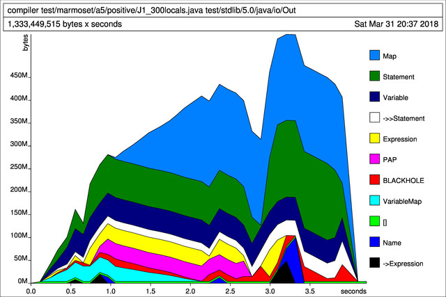

Joos Compiler: Final Report
===========================

## Authors

- Xia Liu
- Ryan O'Leary
- Ahmed Al-Sudani

## Dynamic Dispatch and the VTable

We did not allocate enough time to implement and test dynamic dispatch; however, we
discussed a possible implementation. This implementation is similar to the "Big
Ugly Table" (BUT) discussed in lecture. Generating the code has three steps:

1. All the abstract methods from all abstract classes/interfaces are collected
   into a single column. Methods are qualified with the package and class name.
2. For each concrete class, a corresponding vtable is created where each entry
   is the first concrete implementation while ascending the class hierarchy. If
   no matching function is found, the entry is NULL.
3. At the site of a dynamic method call, the offset into the vtable is found
   statically by matching the method to the first column in the BUT.

For example, consider the following class hierarchy and corresponding table:

                                             |
        abstract class Object {              |
            abstract void f();               |
            abstract void g();               |
        };                                   |    abstract class C extends Object {
                                             |        abstract void h();
        abstract class A extends Object {    |        abstract void f();
            void f() {}                      |    }
            abstract void h();               |
        };                                   |    class D extends C {
                                             |        void f() {}
        class B extends A {                  |        void g() {}
            void g() {}                      |        void h() {}
            void h() {}                      |    }
        }                                    |
                                             |


        | BUT      || B VTable | D VTable |
        |----------||----------|----------|
        | Object.f || A.f      | D.f      |
        | Object.g || B.g      | D.g      |
        | A.h      || B.h      | NULL     |
        | C.h      || NULL     | D.h      |
        | C.f      || NULL     | D.f      |


We did not have the time to implement this; however, we found static dispatch a
suitable replacement in many (but not all) situations.


## Code Generation with a Haskell Monad

Haskell is a purely functional language meaning functions are not allowed to
have any side-effects. All the consequence of calling a function is captured in
its return value.

This proved difficult when side-effects were needed to generate globally unique
labels during code generation. A conventional programming language would
generate unique labels with an idiom like the following:

    int i = 0;
    int nextCounter() {
      return i++;
    }

However, this construct is not possible in Haskell because it modifies global
state which is a side-effect. To circumvent this, we used a `Monad` which is
able to imitate state within the constraints of pure functions.

For example, the following listing is a Haskell function generating code for
the short-circuiting logical AND operator (&&) template. Calling this function
generates code for itself and its sub-expressions.

        -- Note: two dashes start a line comment
        generateExpression ctx (BinaryOperation And x y) = do
          generateExpression' ctx x     -- Generate sub-expression
          cmp Eax (I 1)                 -- Compare Eax to the integer 1
          l <- uniqueLabel              -- Generate a new unique label
          jne (L l)                     -- Jump to the generated label
          generateExpression' ctx y     -- Generate sub-expression
          label l                       -- Insert the label into the assembly

For the expression `true && false`, the following AST is passed into
`generateExpression`:

        (BinaryExpression And
          (LiteralExpression (BooleanLiteral True))
          (LiteralExpression (BooleanLiteral False)))

The generated assembly looks something like this:

        ; BinaryOperation(LiteralExpression(true) && LiteralExpression(false))
          ; LiteralExpression(true)
          mov eax, 1;
        cmp eax, 1;
        jne label6;
          ; LiteralExpression(false)
          mov eax, 0;
        label6:

Notice the two "label6" match and will be unique within the file. In addition
to handling the state, the `Monad` creates a DSL which mimics x86 assembly.

## Memory Leaks and Profiling

While debugging tests, we found "J1_300locals.java" to be remarkably troublesome:

* The first 21 locals used 2 gigabytes
* The first 22 locals used 8 gigabytes
* The first 23 locals used all the machine's swap space

The memory and CPU usage was quadratic!

The memory profile in Appendix A shows the amount of memory used by the
different parts of the Haskell program during one execution.

The following is the diff that we developed through the feedback we received
from the memory profiling tool:

        -    newNext = mapStatementVars f vars $ nextStatement newStatement
        +    newNext = mapStatementVars f vars $ nextStatement s

Source: http://book.realworldhaskell.org/read/profiling-and-optimization.html#id678078

## Class layout

The layout for a class in the generated assembly is as follows:

* Instanceof table (containing null-terminated labels for superclasses) for
  non-abstract class
* vtable for non-abstract class (did not have time to finish)
* static fields with unique global labels
* methods with unique global labels and the implementation of the method.

## Object

### Object layout

Objects are laid out as follows:

* virtual pointer(vptr) pointing to the class vtable
* non-static fields

### Creating a new object

When a new object is created (ie. new expression is called), the assembly code
for it does the following:

* Allocate space for the object. The size in words is the number of dynamic
  fields (for non-static fields) plus one for vptr. Then the size is moved to
  eax, and `__malloc` is called to allocate space.
* The allocated space is cleared using `memclear`
* vptr is saved into the first address of the object.
* Field initializers are evaluated in order and the results are pushed into
  stack. The ordering is from left to right.
* By matching argument types with object name, the constructor label is
  retrived and after saving registers, the constructor is called.
* After the constructor returns, the registers are restored and `esp` is increased
  by 4 times the number of fields.
* The starting address of the object is poped into eax.
* New expression returns the starting address of the object.

## Methods

### Callee

Our group discussed different kind of methods including abstract method, native
methods, regular static and non-static methods, and a special kind of method --
constructors. We have different ways to generate assembly code for each type of
method.

 * The overall steps are generate unique global label for the method, then push
   ebp and mov esp into ebp which creates a frame for the method. The generate
   statements inside the method. Finally after restoring esp and ebp, return
   from the method.
 * The convention used is caller saves.

### Caller

 * Static Method Invocation: all arguments inside caller are evaluated and
   pushed onto the stack from left to right. Then caller saves the necessary
   registers and calls the right method by matching on the method name and
   parameter types. After returning from callee, the result of calling the
   method is stored in eax. Registers are restored. `esp` is increased by the
   number of arguments times four.

 * Dynamic Method Invocation: its procudure is similar to static method
   invocation, but it uses the `this` pointer and vtable lookup. We first get
   `this` pointer and push it into stack. Then the arguments are evaluated and
   pushed onto stack similarly to what static method invocation does. After
   saving registers, the method is called by doing a vtable lookup. (Did not
   have enough time to implement vtables, so we do the lookup using unique
   labels.) After the callee returns, caller restores registers.

### Constructor

 * A method is recognized as constructor if its name is empty. After a
   constructor is called, after saving previous ebp and moving the previous esp
   into ebp, the first thing to do is calling its super constructor. Since super
   constructor is the constructor that has zero parameter, we can just get the
   super constructor label by using concatenation on method, package and name.
   Then the dynamic fields are initialized, and constructor body is generated to
   asm code by generateStatement function. After that esp and ebp are restored
   and the constructor returns. Super constructor is called recursively.
 * `Object` is the superclass for all classes, and doesn't have a super
   constructor, we call the super constructor when we are not in the `Object`
   constructor.

## Arrays

### Layout of an array

The layout for an array is as follows:
* Virtual pointer (vptr) which points to the vtable of the class of the elements
  contained in the array
* Length of the array
* The value of the first element in the array
* The value of the second element in the array
* ....
* The value of the last element in the array

### Creating a new array

The steps to create a new array are similar to those for creating a new object.

1. Get the length of the array.
2. Allocate space for the array and clear it
3. Initialize the array and return a pointer to it

### Accessing an array element

To get access to an element in an array, several steps are executed.

1. Evaluate the lvalue of array, push it into stack as this pointer.
2. Evaluate the index of the array.
3. Do nullcheck to make sure the array object exists.
4. Do bound checking for index
5. Calculate the address based on the index
6. Return the address of the element in eax

## Strings

### Layout of a string object

String is a special array, the layout is similar to an array.
* vptr points to string class
* A pointer to an array of `char`, each letter in the string is one element in
  the char array

### Creating a new string

To create a new string, an object of type string is created. Each letter in
string is moved to corresponding char array element.

## Testing

Our primary method for testing the compiler was the Marmoset test suite. We have
downloaded all the Marmoset tests and stored them in the `test/marmoset`
directory. Each assignment's tests are in their own directory, and each of those
directories contains `positive` and `negative` tests. There are also tests in
`test/codegen` and `test/java-exploration`, which we used for initial code
generation testing and for testing what is legal Java and what isn't.

Our development process was to agree on a breakdown of tasks and work on them,
running `make test.a5` for each change to test the progress we made.

For testing the generated code, we found gdb to be very useful in debugging. We
started gdb by running `gdb --tui output/main` and used the following commands
for stepping through the generated program.

```
(gdb) b _start
(gdb) r
(gdb) n
(gdb) layout regs
```

\pagebreak

# Appendix A


