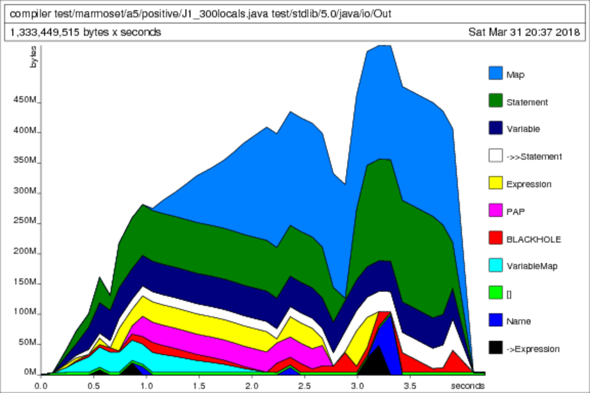

# Dynamic Dispatch and the VTable

We did not allocate enough time to implement and test dynamic dispatch; however, we
discussed a possible implementation. This implementation is similar to the "Big
Ugly Table" (BUT) discussed in lecture. Generating the code has three steps:

1. All the abstract methods from all abstract classes/interfaces are collected
   into a single column. Methods are qualified with the package and class name.
2. For each concrete class, a corresponding vtable is created where each entry
   is the first concrete implementation while ascending the class hierarchy. If
   no matching function is found, the entry is NULL.
3. At the site of a dynamic method call, the offset into the vtable is found
   statically by matching the method to the first column in the BUT.

For example, consider the following class hierarchy and corresponding table:

                                             |
        abstract class Object {              |
            abstract void f();               |
            abstract void g();               |
        };                                   |    abstract class C extends Object {
                                             |        abstract int h();
        abstract class A extends Object {    |        abstract int f();
            void f() {}                      |    }
            abstract void h() {}             |
        };                                   |    class D extends C {
                                             |        int f() {}
        class B extends A {                  |        int g() {}
            int g() {}                       |        int h() {}
            int h() {}                       |    }
        }                                    |
                                             |

        | BUT      || B VTable | D VTable |
        |----------||----------|----------|
        | Object.f || A.f      | D.f      |
        | Object.g || B.g      | D.g      |
        | A.h      || B.h      | NULL     |
        | C.h      || NULL     | D.h      |
        | C.f      || NULL     | D.f      |

We did not have the time to implement this; however, we found static dispatch a
suitable replacement in many (but not all) situations.

# Code Generation with a Haskell Monad

Haskell is a purely functional language meaning functions are not allowed to
have any side-effects. All the consequence of calling a function is captured in
its return value.

This proved difficult when side-effects were needed to generate globally unique
labels during code generation. A conventional programming language would
generate unique labels with an idiom like the following:

    int i = 0;
    int nextCounter() {
      return i++;
    }

However, this construct is not possible in Haskell because it modifies global
state which is a side-effect. To circumvent this, we used a `Monad` which is
able to imitate stat within the constraints of pure functions.

For example, the following listing is a Haskell function generating code for
the short-circuiting logical AND operator (&&) template. Calling this function
generates code for itself and its sub-expressions.

        -- Note: two dashes marks are comment
        generateExpression ctx (BinaryOperation And x y) = do
          generateExpression' ctx x     -- Generate sub-expression
          cmp Eax (I 1)                 -- Compare Eax to the integer 1
          l <- uniqueLabel              -- Generate a new unique label
          jne (L l)                     -- Jump to the generated label
          generateExpression' ctx y     -- Generate sub-expression
          label l                       -- Insert the label into the assembly

For the expression `true && false`, the following AST is passed into
`generateExpression`:

        (BinaryExpression And
          (BooleanLiteral True)
          (BooleanLiteral False))

The generated assembly looks something like this:

        ; BinaryOperation(LiteralExpression(true) && LiteralExpression(false))
          ; LiteralExpression(true)
          mov eax, 1;
        cmp eax, 1;
        jne label6;
          ; LiteralExpression(false)
          mov eax, 0;
        label6:

Notice the two "label6" match and will be unique within the file. In addition
to handling the state, the `Monad` creates a DSL which mimics x86 assembly.

# Memory Leaks and Profiling

While debugging tests, we found "J1_300locals.java" to be remarkably troublesome:

* The first 21 locals used 2 gigabytes
* The first 22 locals used 8 gigabytes
* The first 23 locals used all the machine's swap space

The memory and CPU usage was quadratic!

The following is a diff

        -    newNext = mapStatementVars f vars $ nextStatement newStatement
        +    newNext = mapStatementVars f vars $ nextStatement s

http://book.realworldhaskell.org/read/profiling-and-optimization.html#id678078

